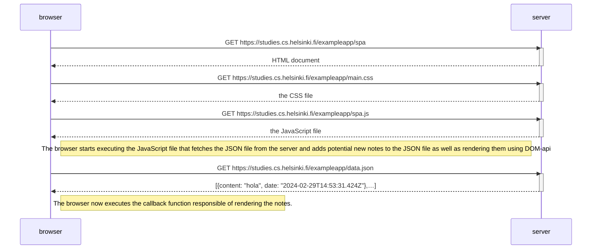

```mermaid
sequenceDiagram
  participant browser
  participant server

  browser ->> server: GET https://studies.cs.helsinki.fi/exampleapp/spa
  activate server
  server -->> browser: HTML document
  deactivate server

  browser ->> server: GET https://studies.cs.helsinki.fi/exampleapp/main.css
  activate server
  server -->> browser: the CSS file
  deactivate server

  browser ->> server: GET https://studies.cs.helsinki.fi/exampleapp/spa.js
  activate server
  server -->> browser: the JavaScript file
  deactivate server
  Note right of browser: The browser starts executing the JavaScript file that fetches the JSON file from the server and adds potential new notes to the JSON file as well as rendering them using DOM-api

  browser ->> server: GET https://studies.cs.helsinki.fi/exampleapp/data.json
  activate server
  server -->> browser: [{content: "hola", date: "2024-02-29T14:53:31.424Z"},…]
  deactivate server
  Note right of browser: The browser now executes the callback function responsible of rendering the notes.
```
