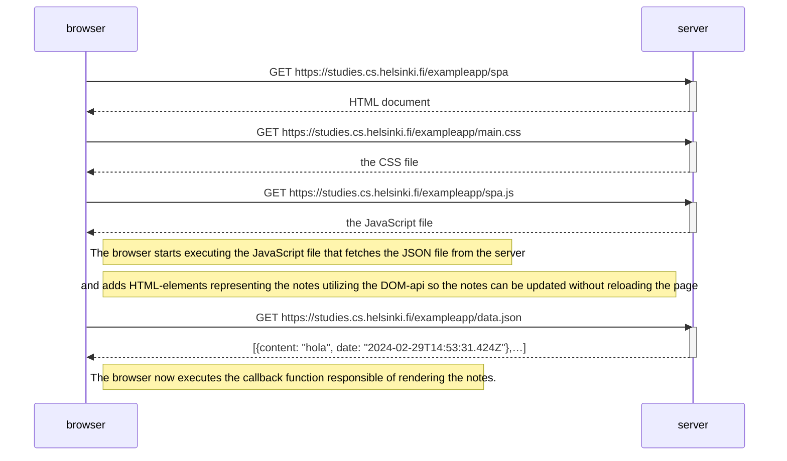

```mermaid
sequenceDiagram
  participant browser
  participant server

  browser ->> server: GET https://studies.cs.helsinki.fi/exampleapp/spa
  activate server
  server -->> browser: HTML document
  deactivate server

  browser ->> server: GET https://studies.cs.helsinki.fi/exampleapp/main.css
  activate server
  server -->> browser: the CSS file
  deactivate server

  browser ->> server: GET https://studies.cs.helsinki.fi/exampleapp/spa.js
  activate server
  server -->> browser: the JavaScript file
  deactivate server
  Note right of browser: The browser starts executing the JavaScript file that fetches the JSON file from the server
  Note right of browser: and adds HTML-elements representing the notes utilizing the DOM-api so the notes can be updated without reloading the page

  browser ->> server: GET https://studies.cs.helsinki.fi/exampleapp/data.json
  activate server
  server -->> browser: [{content: "hola", date: "2024-02-29T14:53:31.424Z"},…]
  deactivate server
  Note right of browser: The browser now executes the callback function responsible of rendering the notes.
```
