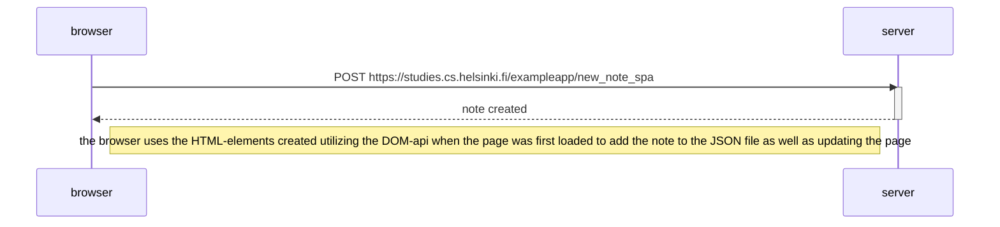

```mermaid
sequenceDiagram
  participant browser
  participant server

  browser ->> server: POST https://studies.cs.helsinki.fi/exampleapp/new_note_spa
  activate server
  server -->> browser: note created
  deactivate server
  Note right of browser: the browser uses the HTML-elements created utilizing the DOM-api when the page was first loaded to add the note to the JSON file as well as updating the page
```
