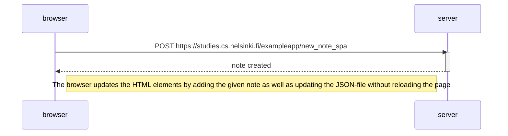

```mermaid
sequenceDiagram
  participant browser
  participant server

  browser ->> server: POST https://studies.cs.helsinki.fi/exampleapp/new_note_spa
  activate server
  server -->> browser: note created
  deactivate server
  Note right of browser: The browser updates the HTML elements by adding the given note as well as updating the JSON-file without reloading the page
```
